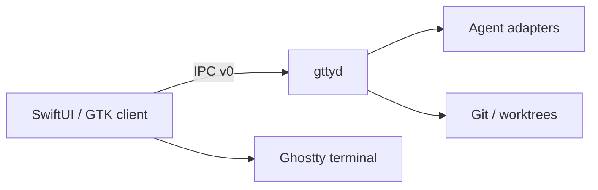

# ADR-0001: GTTY process and ownership boundaries

- Status: Accepted
- Date: 2026-07-29
- Parent: #3

## Decision

GTTY keeps Ghostty as the terminal engine and adds task orchestration as a
separate local process named `gttyd`.

The dependency direction is one-way:

1. Native UI clients depend on the versioned IPC contract.
2. `gttyd` depends on the protocol crate and future adapter/storage crates.
3. The protocol crate depends on neither Ghostty nor platform UI code.
4. Ghostty terminal, renderer, PTY, and input code do not depend on Agent
   adapters or daemon internals.

## Directory ownership

| Path | Owner | Rule |
|---|---|---|
| `gtty/` | GTTY | Rust daemon, protocol, adapters, fixtures |
| `docs/gtty/` | GTTY | Architecture and protocol decisions |
| `macos/**/GTTY/` | GTTY macOS shell | IPC client and GTTY UI only |
| `src/apprt/gtk/gtty/` | GTTY Linux shell | IPC client and GTTY UI only |
| `src/`, excluding the path above | Ghostty | No Agent business logic |
| `macos/`, excluding GTTY-owned paths | Ghostty | Minimal integration points only |

This PR creates only `gtty/` and `docs/gtty/`; native UI integration points
remain proposals until their platform PRs validate the exact build structure.

## Process boundary

`gttyd` is a per-user, local-only daemon. SwiftUI and GTK clients connect over
a private Unix Domain Socket. The daemon owns task state and future Agent/Git
lifecycle operations. Native clients own presentation, user input, terminal
views, notifications, and approval surfaces.

No network listener is permitted for IPC v0.

## Logging and diagnostics

Structured daemon logs will use these stable fields:

- `timestamp`
- `level`
- `component`
- `event`
- `request_id`
- `task_id`
- `session_id`
- `error_code`
- `retryable`
- `duration_ms`

`timestamp` is an unsigned Unix epoch value in milliseconds. The daemon limits
itself to 32 simultaneous local clients; excess connections are rejected with a
structured diagnostic without interrupting existing sessions.

Diagnostic files belong under `$GTTY_STATE_DIR/diagnostics`, falling back to
the platform user-state directory. Credentials, prompt bodies, environment
values, and raw terminal output must be redacted by default. Packaging a
diagnostic bundle is outside this PR.

## Upstream synchronization

GTTY-owned paths are restored from `release` after every upstream merge into a
dedicated synchronization branch. Changes to shared Ghostty files must remain
small, named as integration points, and documented in this ADR before merge.
Direct Agent imports into Ghostty core are rejected during review.

## Consequences

- Ghostty upstream can continue moving without owning GTTY task semantics.
- macOS and Linux share one task model despite different native UI toolkits.
- IPC compatibility and daemon lifecycle become explicit product concerns.
- The extra process adds startup, reconnection, and diagnostics work that later
  milestones must handle.
