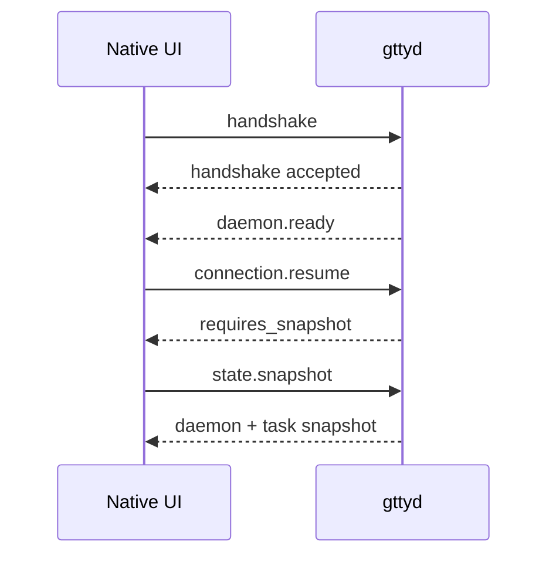

# GTTY IPC v0

IPC v0 is the local contract between native GTTY clients and `gttyd`.

## Transport and permissions

- Transport: Unix Domain Socket only.
- Framing: one UTF-8 JSON object per line.
- Maximum frame size: 1 MiB, excluding the newline delimiter.
- Socket mode: `0600`.
- Parent directory mode: `0700`; pre-existing broader directories are rejected,
  not modified.
- Override: `$GTTY_RUNTIME_DIR/gtty/gttyd.sock`.
- Linux default: `$XDG_RUNTIME_DIR/gtty/gttyd.sock`, then
  `$HOME/.cache/gtty/gttyd.sock`.
- macOS default:
  `$HOME/Library/Caches/com.gtty.terminal/gttyd.sock`.

The daemon refuses to replace an existing socket path. Stale-socket recovery
will require an explicit liveness check in a later lifecycle PR.

## Version and capability negotiation

The first client frame must be `kind: "handshake"`. Both peers publish
`{major, minor}`:

- different major versions are rejected with `incompatible_version`;
- for an equal major, the negotiated minor is the lower minor;
- negotiated capabilities are the string intersection;
- unknown JSON fields and unknown capability strings are ignored.

IPC v0 currently implements protocol `0.1`. See the executable examples under
`gtty/protocol/v0/examples`. The `daemon.ready` event is part of the base
handshake sequence rather than an optional capability.

## Envelopes

Client envelopes:

- `handshake`: request ID, client identity, version, capabilities;
- `request`: request ID, optional task/session IDs, method, parameters, timeout.

Server envelopes:

- `handshake`: accepted flag, negotiated version/capabilities, optional error;
- `response`: matching request ID, result or structured error;
- `event`: event ID, optional task/session IDs, typed event data.

Request IDs are generated by the caller and must be unique for one connection.
Task and session IDs are opaque strings. Event IDs are generated by the daemon.

## Methods

| Method | Purpose | IPC v0 behavior |
|---|---|---|
| `state.snapshot` | Rebuild client state after connect/reconnect | Returns daemon protocol, uptime, and task snapshots |
| `connection.resume` | Attempt event-stream resumption | Returns `resumed: false` and `requires_snapshot: true` until event cursors land |

Clients must call `state.snapshot` when resume reports
`requires_snapshot: true`.

## Events

| Event | Purpose |
|---|---|
| `daemon.ready` | Confirms the daemon accepted the connection |
| `task.state_changed` | Carries previous/current task state |
| `diagnostic` | Carries a stable code, severity, and safe message |

The initial daemon sends `daemon.ready` immediately after an accepted
handshake. Task and diagnostic producers are defined here but implemented in
later milestones.

## Errors, retries, and timeouts

Errors contain `code`, `message`, and `retryable`. IPC v0 codes are:

- `invalid_request`
- `incompatible_version`
- `not_handshaken`
- `timeout`
- `unavailable`
- `internal`

Clients may retry only when `retryable` is true. `timeout_ms` is a client
deadline hint; timeout enforcement is added with asynchronous request
execution. A version rejection and validation error are never retryable without
changing the request or peer version.

## Connection sequence

## Security limits

IPC v0 is local and per-user. It does not authenticate remote callers, carry
secrets, or expose a TCP port. Socket permissions are the first boundary;
authorization of individual Agent actions is a later protocol extension.
